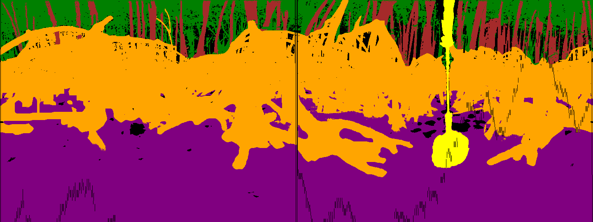
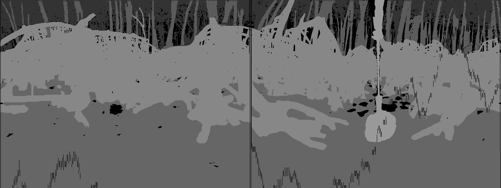
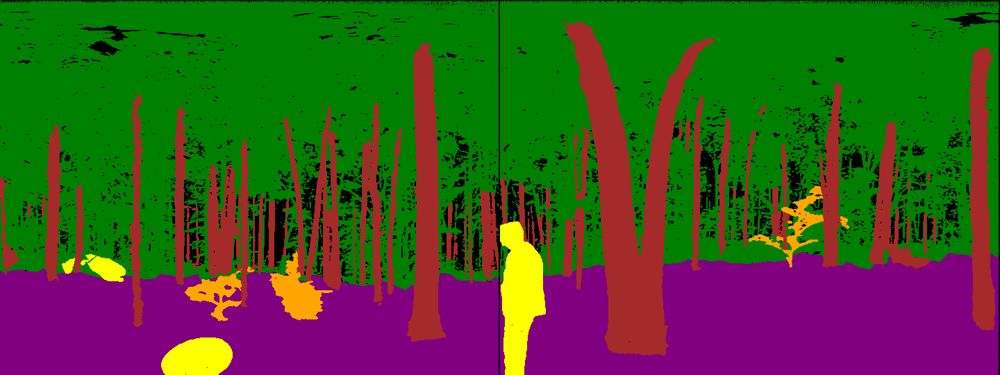
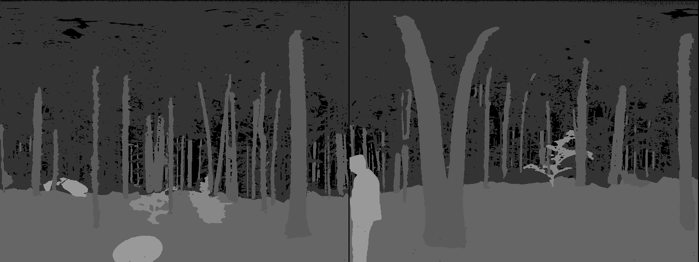

# **Annotation Guideline for Forest and Mangrove Root Scene Semantic Segmentation**

This guideline is designed to ensure consistency and accuracy when labeling **Harvard Forest** and **Mangrove Root** scenes for semantic segmentation. It defines the labeling rules for specific categories in both environments to support ecological applications such as biomass estimation, structural analysis, and habitat modeling.

---

## **1\. General Rules**

* **Dominance**: Label each point based on the dominant feature within its spatial neighborhood.  
* **Precision**: Annotate boundaries as accurately as possible. Use zoom tools in annotation software for detailed labeling.  
* **Overlapping Features**: Assign labels based on the visible feature, considering occlusions and structural prominence:  
  * For forests: **Hierarchy**: Trunk \> Large Branches \> Leaves \> Deadwood \> Ground/Terrain \> Bushes/Undergrowth \> Miscellaneous.  
  * For mangroves: **Hierarchy**: Roots \> Trunk \> Ground \> Canopy \> Water \> Miscellaneous.  
* **Occlusions**: For partially visible objects, label only the visible portions. For fully obscured areas, rely on the category of the covering object.

---

### **2\. Label Definitions and Guidelines**

For Harvard Forest

#### **1\. Forest Floor**

**Definition:** The exposed ground in the forest, including soil, rocks, and other bare terrain.

* **Inclusions:**  
  * Bare ground, muddy surfaces, or soil with minor debris.  
  * Rocks or boulders as part of the terrain.  
* **Exclusions:**  
  * Grass, shrubs, or undergrowth covering the soil, fallen leaves or woody debris (label as **Understory**).

#### **2\. Tree Trunks**

**Definition:** Main vertical structures of trees used for tree metrics like DBH.

* **Inclusions:**  
  * Tree trunks and large, exposed bases of trees.  
* **Exclusions:**  
  * Thin branches or secondary stems (label as **Branches & Canopy**).  
  * Detached logs on the ground(label as **Understory**).

#### **3\. Branches & Canopy**

**Definition:** Primary branches and foliage that make up the canopy or upper layers of the forest.

* **Inclusions:**  
  * Exposed, visible large branches connected to the trunk.  
  * Tree canopy leaves and small branches.  
  * Shrub leaves forming part of the understory.  
* **Exclusions:**  
  * Fallen leaves or branches on the ground (label as **Understory**).

#### **4\. Understory**

**Definition:** Living vegetation and woody debris that form the lower layers (shorter than a person) of the forest.

* **Inclusions:**  
  * Shrubs, ferns, grass, and other ground-level vegetation.  
  * Fallen or decaying wood lying on the forest floor.  
  * Logs used for ecological studies.  
* **Exclusions:**  
  * Dead branches attached to trees (label as **Tree Trunks** or **Branches & Canopy**).  
  * Small trees or saplings (label based on height and structure).

#### **5\. Objects**

**Definition:** Non-natural or external objects in the scene.

* **Inclusions:**  
  * People, LiDAR stands, or measurement tools.  
  * Other artificial objects.

### **Harvard Forest Segmentation Table**

| Label Name | Segmentation Label | Color Patch |
| :---- | :---- | :---- |
| Void | 0 | Black ⚫ |
| Forest Floor | 1 | Purple 🟣 |
| Tree Trunks | 2 | Brown🟤 |
| Branches & Canopy | 3 | Green 🟢 |
| Understory | 4 | Orange🟠 |
| Objects | 5 | Yellow🟡 |

---

* The right annotation order could save you a lot of time, since the image general can be splitted into two layers \- **canopy+trunks** vs **forest floor**:  
  1. First, roughly label the **Forest floor** area, pay close attention to the edge between **forest floor** and **Branches & Canopy** \- it’s okay to include   
  2. Second, revert the Forest floor mask to get the mask of **Branches & Canopy**;  
  3. Third, label the **Tree trunks**, **Understory**, and **Objects** respectively, use image-threshold to binarize them.  
  4. Fourth, label the **void** pixels.use the Load selection function to subtract **Void** pixels from **tree trunks**, **understory,** and **Objects;**  
  5. Fifth, use the Load selection function to subtract **tree trunks**, **understory, Objects** and **Void** pixels from forest floor;  
  6. Sixth, similarly, subtract the **tree trunks**, **understory, objects** and **void** pixels from **branches & canopy**.

### **For Mangrove Roots**

#### **a. Ground/Water**

* **Definition**: Soil or muddy terrain beneath the mangroves.  
* **Inclusions**:  
  * Mudflats, sandy soil, or sediment layers.  
* **Exclusions**:  
  * Roots partially embedded in soil (label as **Roots**).

#### **b. Roots**

* **Definition**: All root structures of mangroves, categorized further into:  
  * **Aerial Roots**: Above-ground roots like prop or stilt roots.  
  * **Grounded Roots**: Roots partially embedded in soil.  
  * **Species-Specific Roots**:  
    * Pneumatophores of *Sonneratia alba*.  
    * Prop roots of *Rhizophora* species.  
    * Ribbon roots of *Xylocarpus granatum*.  
* **Inclusions**:  
  * All visible root structures.  
* **Exclusions**:  
  * Trunk-like structures (label as **Stem**).

#### **c. Stem**

* **Definition**: Vertical stems of mangroves supporting above-ground biomass.  
* **Inclusions**:  
  * Main upright structures of mangrove trees.  
* **Exclusions**:  
  * Low-lying aerial roots (label as **Roots**).

#### **d. Canopy**

* **Definition**: Foliage and small branches forming the upper structure of mangroves.  
* **Inclusions**:  
  * Leaves and small twigs visible above the trunk and roots.  
* **Exclusions**:  
  * Detached branches or leaves on the ground (label as Roots).

#### **e. Objects**

* **Definition**: Non-natural objects in the scene or unclear points.  
* **Inclusions**:  
  * Boats, researchers, or equipment visible in the scene.

### **Mangrove Roots Segmentation Table**

| Label Name | Segmentation Label | Color Patch |
| :---- | :---- | :---- |
| Void | 0 | Black ⚫ |
| Ground & Water | 1 | Purple 🟣 |
| Stem | 2 | Brown🟤 |
| Canopy | 3 | Green 🟢 |
| Roots | 4 | Orange🟠 |
| Objects | 5 | Yellow🟡 |

* The right annotation order could save you a lot of time, since the image generally consist of three layers (**canopy** \+ **stem**) vs (**roots**) vs (**ground** & **water**)  :  
  1. roughly label the three layers \- **canopy** vs **roots** vs **ground\&water**   
  2. select **Objects**.  
  3. Refine **Roots**: select more roots;   
  4. Refine **Ground & Water**: select more **ground\&water** among **roots**, add it to previous **ground\&water**, then subtract **ground\&water** from **roots.**  
  5. select **stem**, subtract **stem** from **roots** and **canopy**  
  6. Select the **void** pixels.use the Load selection function to subtract **Void** pixels from **canopy, roots, stem,** and **Objects;**  
  7. subtract **Objects** from **Canopy, Roots** and **Ground & Water**.

### ---

## **3\. Dataset Checklist**

Before finalizing annotation:

* Verify all categories are consistent with the guidelines.  
* Confirm clear boundaries between adjacent categories.  
* Validate segmentation maps for errors (e.g., mislabeled points or missing data).  
* Ensure both forest and mangrove-specific categories are represented.

---

Extra Note: [emoji-keys](https://1000logos.net/emoji-copy-and-paste/) \# (Emoji Key: 🟢 🟤 🟣 🟠 🟡 ⚫ )

## Example Segmentation Maps
The segmentation maps should be saved in PNG format with the same resolution as the original images. 

| Mangrove Segmentation Map | Mangrove Grayscale Segmentation Map |
|---------------------------|-------------------------------------|
|  |  |

| Harvard Forest Segmentation Map | Harvard Forest Grayscale Segmentation Map |
|---------------------------------|-------------------------------------------|
|  |  |